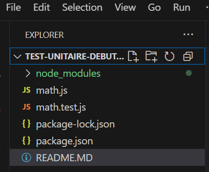

Création du dossier TEST-UNITAIRE-DEBUTANT (depuis GitHub avec clonage du dossier grâce à GitHub Desktop).

Téléchargement des outils nécessaires (Node.js et Jest) depuis le Terminal (Bash).

Pour installer Node.js : npm init -y  [cela installera aussi le package json]

Jest : npm install --save-dev jest

