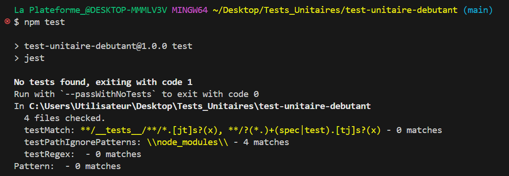

## TEST-UNITAIRE-DEBUTANT
___
1) Création du dossier <b>TEST-UNITAIRE-DEBUTANT </b>(depuis GitHub avec clonage du dossier grâce à _GitHub Desktop_).

2) Téléchargement des outils nécessaires (_Node.js_ et _Jest_) depuis le Terminal (_Bash_).

>Pour **installer Node.js** :    
npm init -y  

Cela installera aussi le package.json du projet /// pour mémoire, dans les projets JS, le fichier package.json simplifie la gestion des métadonnées et des dépendances d'un projet . Ce fichier garantit qu'un projet dispose toujours d'informations à jour sur les bibliothèques et les outils nécessaires à son bon fonctionnement.

>Pour **Jest** :   
npm install --save-dev jest     

J'obtiens un message d'erreur lorsque je lance la commande. Cela implique la modification d'une ligne de code dans le package.  
  
  
>     
*Message d'erreur lors du passage de Test (il faudra modifier le nom du fichier math_test.js en math.test.js car Jest reconnaît d'office certain format mais pas l'underscore).*

>   
*Arborescence du dossier TEST-UNITAIRE-DEBUTANT originale*   

>  
 *Arborescence du dossier TEST-UNITAIRE-DEBUTANT modifiée*  

>**Lancement des tests** : 
npm test 

1. Test réussi :  

  

  
  

2. Test échoué :  
  
  

    

